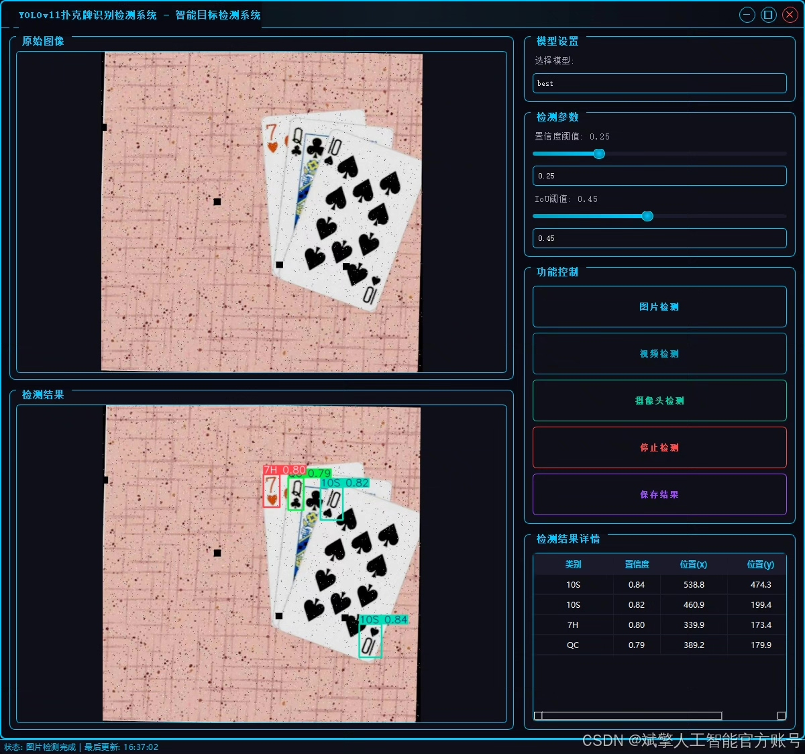
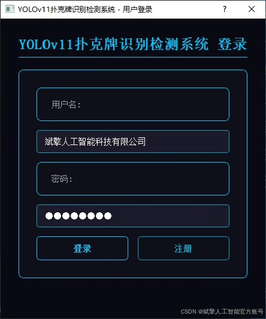
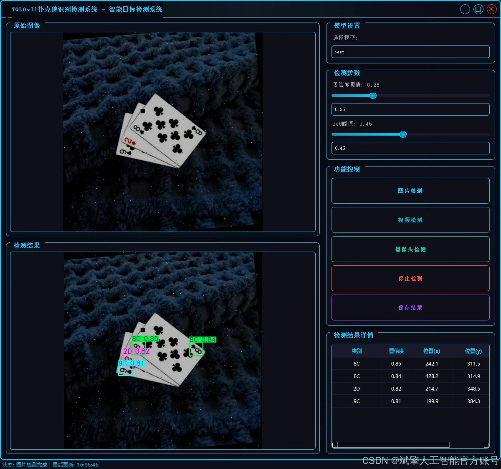
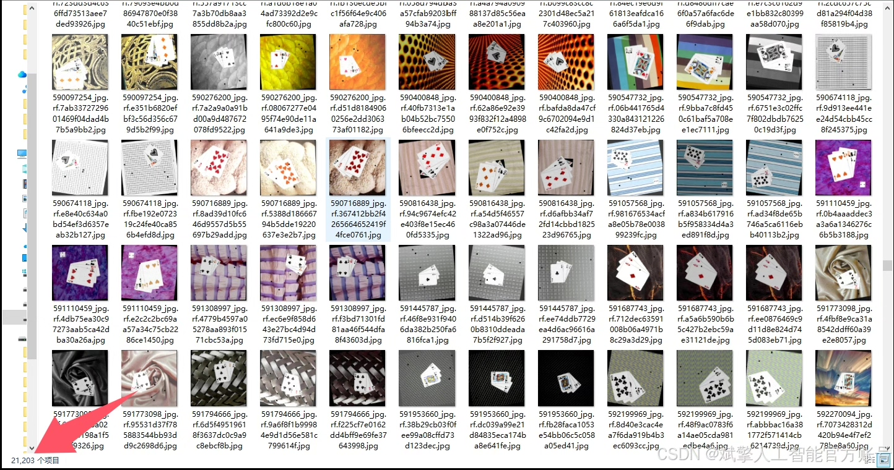
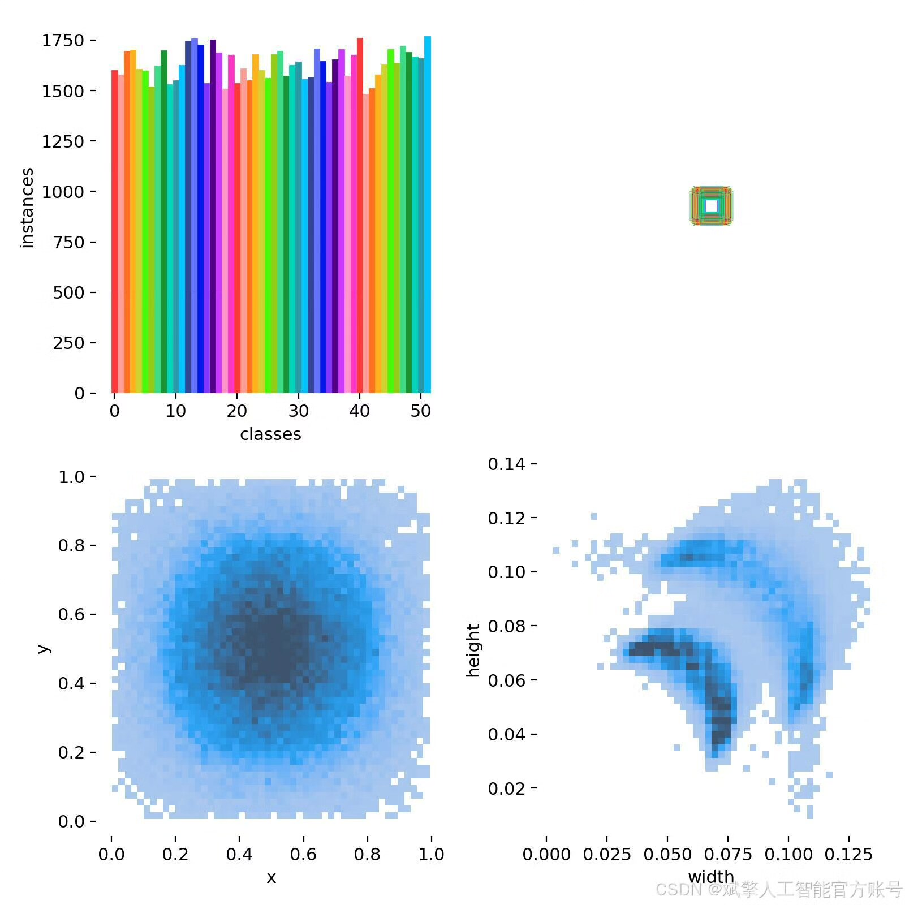
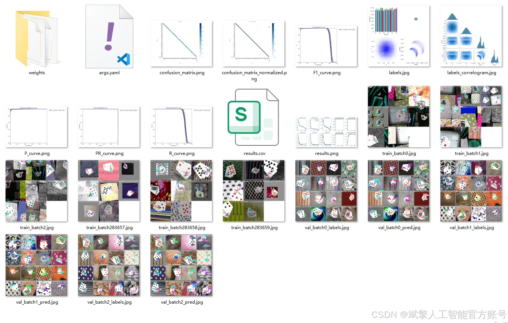
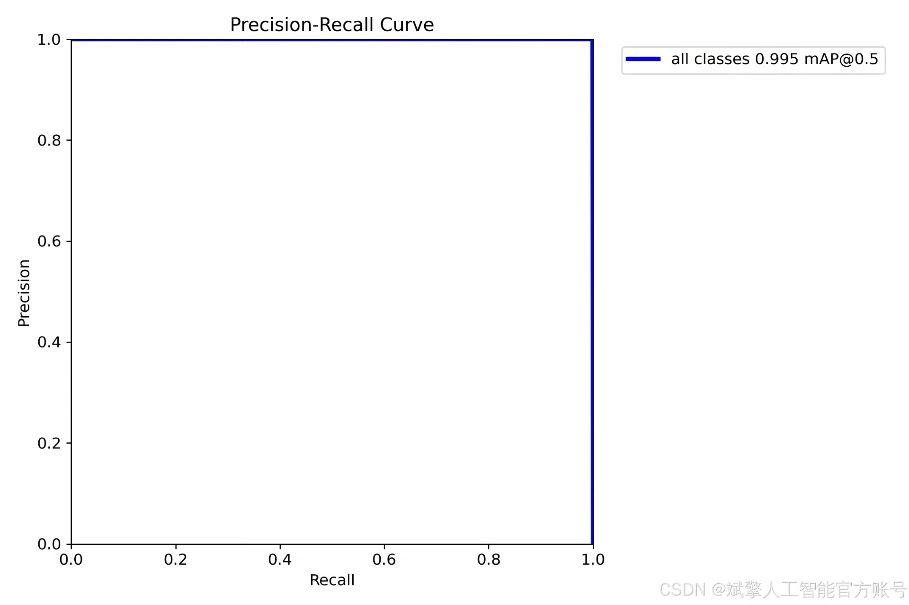
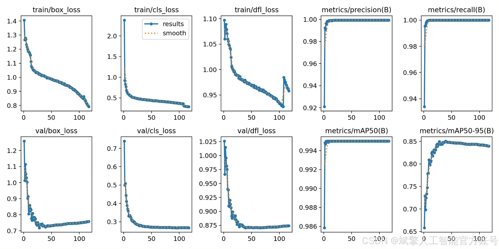
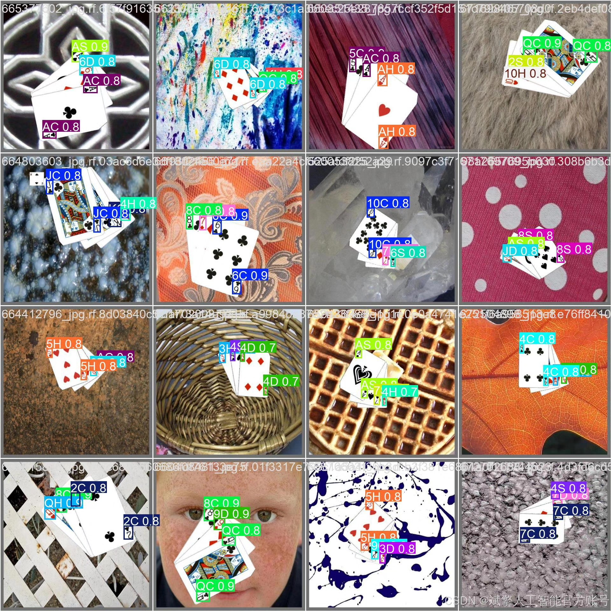

# YOLOv11 Poker Card Recognition System

## Body

This paper introduces a poker card recognition detection system based on deep learning YOLOv11. The system can efficiently and accurately recognize and detect various types of poker cards (a total of 52 categories, including number cards and flower cards). The system employs the YOLOv11 object detection algorithm, combined with a custom large-scale YOLO format dataset (training set 21,203, validation set 2,020, test set 1,010), to achieve high precision in poker card localization and classification. Additionally, the system is equipped with a user-friendly UI interface that supports login and registration functions. Experimental results show that the system has strong robustness and real-time performance under complex scenarios, and can be applied in areas such as game development, security monitoring, and automated classification. This paper elaborates on the entire process of algorithm design, dataset construction, model training, and system implementation, and provides complete Python project source code and pre-trained models.
✅ User Login and Registration: Supports password verification and security validation.
✅ Three detection modes: Based on the YOLOv11 model, supporting image, video, and real-time camera detection, for precise target recognition.
✅ Dual-screen comparison: Displaying the original scene and detection results simultaneously on the screen.
✅ Data visualization: Real-time table displaying the category, confidence, and coordinates of detected targets.
✅ Intelligent parameter adjustment: Offers a confidence slide bar to dynamically optimize detection accuracy, adapting to different scene requirements.
✅ Sci-fi style interactive interface: Dark theme paired with dynamic light effects, reducing visual fatigue and enhancing operational experience.

## Images

## Payment

Here is a pay link on Stripe ( https://buy.stripe.com/3cs8yP7sY87d0vu9AB ). Please contact me lonlonago@foxmail.com after funding $89, and I will send you a complete data files , thank you!

